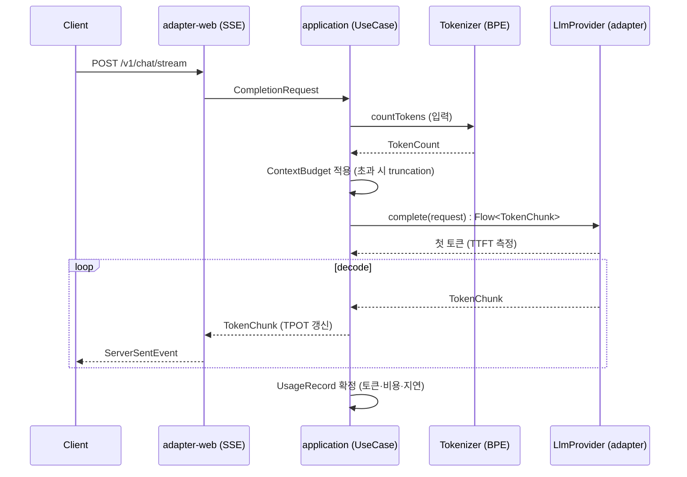

# llm-gateway 아키텍처 설계

멀티 공급자 LLM 게이트웨이. 사용자가 로컬에서 자기 API 키로 실행한다(BYO-key). 모든 LLM 호출이 통과하는 표준 진입점으로, 토큰 카운팅·컨텍스트 예산·디코딩 파라미터·스트리밍·사용량 관측을 담당한다.

## 배경 / 문제

- 시스템 관점: 팀·서비스마다 LLM 공급자 SDK를 직접 호출하면 토큰 카운팅, 컨텍스트 초과 처리, 디코딩 파라미터, 재시도, 비용 집계가 호출부마다 흩어진다.
- 비용 관점: LLM 호출 비용은 실제 예산 항목이다. 호출 단위 토큰·비용을 한 곳에서 집계하지 않으면 통제 불가.
- 공개 관점: 공개 레포로 배포한다. 특정 공급자 키가 레포에 포함되거나, 배포자의 키로 불특정 다수가 호출하는 상황을 구조적으로 차단해야 한다.
- 학습 관점: LLM 내부 개념(토크나이제이션, 디코딩, prefill/decode 스트리밍)을 프로덕션 가능한 형태로 손으로 구현해 체득한다.

## 결정

### D1. 아키텍처: 헥사고날(포트 & 어댑터)

- 채택: 도메인 코어를 공급자·프레임워크와 분리. LLM 공급자는 아웃바운드 어댑터, HTTP/SSE API는 인바운드 어댑터.
- 근거: 공급자(Claude/GPT/Gemini)는 교체·추가되는 세부사항이다. 토큰 예산·디코딩 정책·사용량 집계 같은 정책은 공급자와 무관하게 고정된다. 정책을 코어에, 세부사항을 어댑터에 둔다.
- 트레이드오프: 초기 보일러플레이트(포트 인터페이스, 매핑 계층) 증가.
- 제외: 공급자 SDK를 서비스에서 직접 호출하는 단일 계층 구조. 공급자 추가 시 정책 코드가 오염됨.

### D2. 모듈: Gradle 멀티모듈로 경계를 컴파일 타임에 강제

- 채택: 책임별 Gradle 모듈 분리. 의존성 방향을 빌드 스크립트로 강제.
- 근거: 패키지 분리만으로는 잘못된 방향 import를 사람이 막아야 한다. 모듈 분리는 `core-domain`이 Spring이나 공급자 모듈을 import하는 것을 컴파일 단계에서 불가능하게 만든다. 책임 분리를 규율이 아니라 구조로 보장한다.
- 트레이드오프: 모듈 수만큼 빌드 설정 증가, 초기 진입 비용 상승.
- 제외: 단일 모듈 + 패키지 컨벤션. 규모가 커지면 방향 위반을 통제하기 어려움.

### D3. 의존성 규칙: 안쪽(core-domain)을 향한다

```
bootstrap ─┬─▶ adapter-web ───────┐
           ├─▶ adapter-provider-* ─┼─▶ core-domain ◀── (아무것도 의존하지 않음)
           ├─▶ adapter-tokenizer-* ┤        ▲
           └─▶ application ────────┘        │
                    └──────────────────────┘
```

- `core-domain`: 순수 Kotlin. Spring·HTTP·공급자 SDK 의존 0.
- 의존 화살표는 항상 `core-domain`을 향한다. 역방향 금지.
- `bootstrap`만 모든 모듈을 알고 조립(DI)한다.

이 구조에서 특히 볼 포인트:
- `core-domain`에 Spring 애너테이션이 하나도 없다. 도메인 규칙을 프레임워크 없이 단위 테스트한다.
- 공급자 추가는 `adapter-provider-신규` 모듈 하나 추가로 끝난다. 코어·다른 어댑터 무변경.

### D4. 스트리밍: Kotlin 코루틴 + Flow, Spring WebFlux

- 채택: 토큰 스트림을 `Flow<TokenChunk>`로 모델링. 인바운드는 WebFlux SSE(`Flow<ServerSentEvent>`), 아웃바운드는 WebClient의 스트리밍 응답을 Flow로 변환.
- 근거: decode 루프(토큰 1개씩 생성)와 Flow(원소 1개씩 방출)가 개념적으로 일치한다(노트 09). 코루틴으로 TTFT 측정과 취소·타임아웃을 자연스럽게 표현.
- 트레이드오프: WebFlux 학습 곡선. 블로킹 라이브러리 혼용 시 주의.
- 제외: Spring MVC + SseEmitter. 명령형이라 decode 스트림 표현이 코루틴보다 장황함. 대안으로 MVC + 가상 스레드는 보류(미정 U2).

### D5. 보안: BYO-key, 크리덴셜은 레포에 부재

- 채택: 키는 `.env`(gitignore)와 환경변수로만 주입. 레포에는 `.env.example`(빈 값)만 포함. 공유 호스팅 없음.
- 근거: 각 사용자가 자기 키로 로컬 실행하면 배포자 키 유출·도용 경로가 없다.
- 금지: 어떤 공급자 키도 소스·설정·테스트 픽스처에 하드코딩. 자기 키로 공개 배포.
- 리스크: 사용자가 실수로 `.env`를 커밋. 완화: `.gitignore` 명시 + README 경고 + 예시 파일 빈 값.

## 모듈 구조

| 모듈 | 책임 | 의존 | 프레임워크 |
|------|------|------|-----------|
| `core-domain` | 도메인 모델·정책·포트 인터페이스. 토큰·컨텍스트 예산·디코딩 프리셋·사용량·공급자 포트 | 없음 | 순수 Kotlin |
| `application` | 유스케이스 오케스트레이션. 카운트→예산→공급자 선택→스트림→집계 | core-domain | 최소(코루틴) |
| `adapter-web` | 인바운드. REST/SSE 컨트롤러, DTO, 예외 매핑, TTFT/TPOT 관측 | application, core-domain | Spring WebFlux |
| `adapter-tokenizer-bpe` | BPE 토크나이저 직접 구현. `Tokenizer` 포트 구현 | core-domain | 순수 Kotlin |
| `adapter-provider-anthropic` | Anthropic 어댑터. `LlmProvider` 포트 구현 | core-domain | WebClient |
| `adapter-provider-openai` | OpenAI 어댑터 | core-domain | WebClient |
| `adapter-provider-gemini` | Gemini 어댑터 | core-domain | WebClient |
| `bootstrap` | Spring Boot 진입점. 설정·키 로딩·DI 조립·actuator | 전체 | Spring Boot |

## 포트 설계

핵심 포트 2개를 `core-domain`이 정의하고, 어댑터가 구현한다.

- `LlmProvider` (아웃바운드): `suspend fun complete(request: CompletionRequest): Flow<TokenChunk>`. 공급자별 요청 매핑과 SSE 파싱은 어댑터 내부.
- `Tokenizer` (아웃바운드): `fun encode(text: String): List<Int>` / `fun countTokens(messages: List<ChatMessage>): TokenCount`. BPE 구현이 어댑터.

도메인 값 객체(발췌):
- `DecodeParams(temperature, topP, topK)`, `DecodePreset { FACTUAL_QA, BALANCED, CREATIVE }` (노트 08).
- `ContextWindow(maxTokens)`, `ContextBudget` (입력 토큰 + 출력 예약 토큰이 윈도우를 넘으면 truncation 전략 적용, 노트 02/09).
- `UsageRecord(inputTokens, outputTokens, costEstimate, ttftMillis, tpotMillis)` (노트 07/09).

## 스트리밍 경로

이유: prefill/decode 두 국면(노트 09)을 관측 지점으로 드러내기 위해 요청부터 SSE 방출까지 경로를 고정한다.



해석:
- 첫 토큰 도착 시각으로 TTFT(prefill 지연)를 측정한다.
- 토큰 간 간격으로 TPOT(decode 속도)를 집계한다.
- 컨텍스트 예산은 공급자 호출 전에 적용해 윈도우 초과 실패를 예방한다.

## 리스크 / 미정

- 리스크 R1: 로컬 정확 토큰 카운팅은 공급자 vocab에 의존한다. OpenAI 계열은 공개 BPE로 정확 카운팅 가능. Anthropic·Gemini는 공개 vocab 부재로 근사 카운팅 또는 공급자 count-tokens 엔드포인트 사용. 이 한계를 문서·응답 메타데이터에 명시한다.
- 리스크 R2: 공급자별 SSE 청크 포맷·파라미터명(temperature/top_p/top_k) 차이. 어댑터 매핑 계층에서 흡수. 매핑 누락 시 파라미터 무시 가능성.
- 미정 U1: 임베딩 기반 시맨틱 캐시(노트 03) 포함 여부. 초기 범위에서 보류.
- 미정 U2: WebFlux 대신 Spring MVC + 가상 스레드 채택 여부. 초기엔 WebFlux 확정, 재검토 보류.
- 미정 U3: Rate Limiting·Fail-Open 폴백(기존 블로그 자산) 게이트웨이 편입 시점.

## 영향도

- 새 공급자 추가: `adapter-provider-신규` 모듈 추가 + `bootstrap` 설정 등록. 코어·기존 어댑터 무변경.
- 공급자 SSE 장애: 스트림 중단이 UseCase로 전파, 부분 UsageRecord 확정 후 클라이언트에 오류 이벤트. (폴백 정책은 U3.)
- 컨텍스트 윈도우 초과: 공급자 호출 전 ContextBudget이 truncation 적용. 적용 내역을 응답 메타데이터에 기록.

## 로드맵

1. 뼈대: 멀티모듈 Gradle + 공개 안전 기본 파일.
2. `core-domain`: 토큰·컨텍스트 예산·디코딩 프리셋·포트.
3. `adapter-tokenizer-bpe`: BPE 직접 구현.
4. `adapter-provider-*`: 공급자 1개부터.
5. `adapter-web` + `bootstrap`: REST/SSE + 관측.
6. 개발로그 문서화 축적(블로그·포트폴리오 재료).
